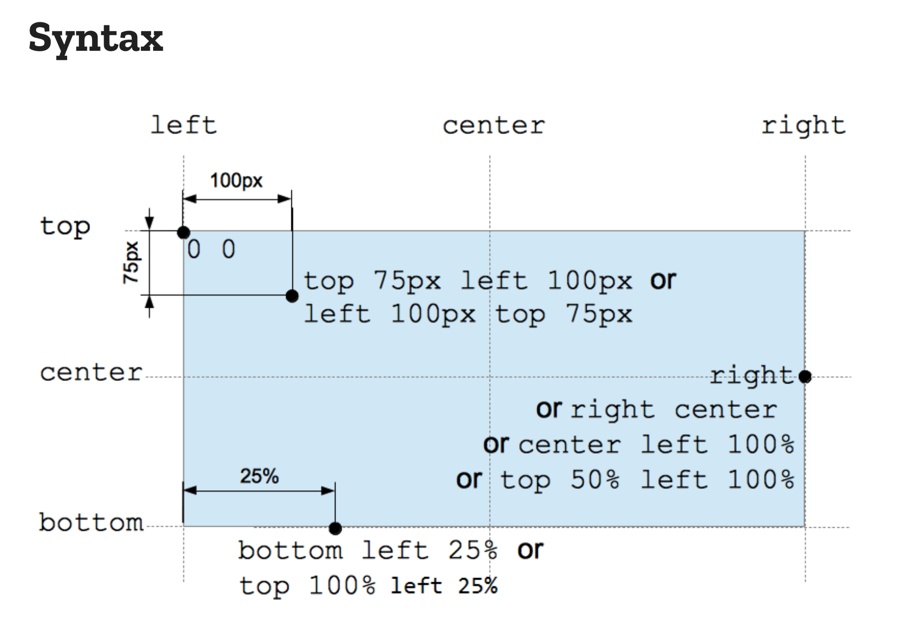

Carousel Tutorial
=================

## HTML + CSS Time. Let's Go!


### Carousel (index.html)
Working from scratch. Add this bit code to your index.html file

```
<!DOCTYPE html>
<html lang="en">
<head>
    <meta charset="UTF-8">
    <meta http-equiv="X-UA-Compatible" content="IE=edge">
    <meta name="viewport" content="width=device-width, initial-scale=1.0">
    <title>Document</title>
</head>
<body>

</body>
</html>
```
The concept


We will create a window for our images to show. Nested inside of that window will be our image slider. The image slider are  all of our images, as many as we link stacked horizontally. 

The key is making sure that all of the images are of the same widths. So that we can translate that row of images to the left the same amount each time to show a new image. Since the width and height of the window is fixed and we hide the images outside of the window, only one image will show on the screen at a time.

Challenge how could we alter this so that three images show on the screen at one time? 

Next steps.

**Critical Thinking**: How do we create a window?**

Use a div tag with an id of window and center it in the middle of the screen

html
```
 <div id="window"></div>
```

css
```
#window {
    display: flex;
    justify-content: center;
    width: ThisNeedsToBeTheWidthOfYourImage
    height: YouCanSetThisBeWhatYouLike
}
```

Now we need to create a row of images. Create a div inside of the window with an id of imageSlider.

html
```
<div id="window">
  <div id="imageSlider">
    
    
    
  </div>
</div>
```

**Critical Thinking**: How come the images are stacking vertically?

**Critical Thinking**: How can we make the images stack horizontally?

Update the CSS for the imageSlider to display flex

CSS
```
 #imageSlider {
     display: flex
 }
```

Lets think about how we can make this move. Let's look at the Transform Documentation.

**Poll**: What does transform translate do? How can we use it serve our purpose?

Before we implement this tranform translate function we need to understand one more thing:



The origin of the web coordinate system actually starts in the top left of the webpage. When you move to the right on the x axis from the origin, those values will be positive. When you move down the y axis from the origin those values will be positive. This is different than the cartesian coordinate system that we grew up using in grade school.

**Critical Thinking**: If we want to translate our image slider to the left will value we translate by be positive or negative?

Let's play around with translateX function to see how it will transform our imageSlider

```
#imageSlider {
    display: flex;
    transform: translateX(400px);
}
```

**Critical Thinking**: When we translated our image slider by 400px why do we not see the next image?

This time lets translate by

```
#imageSlider {
    display: flex;
    transform: translateX(-400px);
}
```

How can automate an animation? Let's look at the documentation.

The syntax we need to use for our imageSlider to automate it to move without us manually changing the values for translateX is as follows:

```
 animation: yourSelectedAnimationName duration easing-function delay 
```

To use the animation CSS property we neet to create the animation using `keyframes`.

`keyframes` at-rule controls the intermediate steps in a CSS animation sequence by defining styles for the keyframes (or waypoints) along the animation sequence.

All you need to do is specify the starting point and ending point of some CSS property and values and keyframes will render the intermediate steps to animate the sequence.

Lets create the animation called move using keyframes. Copy and paste this code into your main.css

```
#imageSlider {
    display: flex;
    transform: translateX(000px);
    animation: move 20s infinite;
}

  
  @keyframes move {
    0% { transition: ease-in; transform: translateX(-100%); }
    50% { transition: ease-in; transform: translateX(-200%); }
    100% { transition: ease-in; transform: translateX(-300%); }
  }
```

**Poll**: In your own words, What's going on here?

**Challege**: How can we make this reverse when it reaches the end instead of restarting at the beginning?


**Nightmare Mode Challenge**: How can we we animate a circle that morphs into a square oscilating back and forth 800px and changes colors in the process?


Here's some lists Resources: <br>
 **[Carousel Lecture](https://zoom.us/rec/play/vFCE-qfQ19LqQ0h2qw6AJ70gtzxENq0N9uFXwQYeugJVJ2VvwjorAUMCH2SECtdmjtmg54MF8NzNfYo7.-GP2BB1IHJrf6phN?startTime=1598309998000&_x_zm_rtaid=Q08hXwE5TVGc1X_1sm4p8A.1618853513656.35e38ddca1351b172ec2cd9b037a471d&_x_zm_rhtaid=12)** <br>
 **[Transform Translate](https://www.w3schools.com/css/css3_2dtransforms.asp)** <br>
 **[Transform Documentation](https://developer.mozilla.org/en-US/docs/Web/CSS/transform)** <br>
 **[Animation w3Schools Documentation](https://www.w3schools.com/css/css3_animations.asp)** <br>
 **[Animation MDN Documentation](https://www.w3schools.com/css/css3_animations.asp)** <br>

- [Overflow](https://developer.mozilla.org/en-US/docs/Learn/CSS/Building_blocks/Overflowing_content)
- [Box Model](https://developer.mozilla.org/en-US/docs/Learn/CSS/Building_blocks/The_box_model)
- [CSS Coordinate System](https://developer.mozilla.org/en-US/docs/Web/CSS/transform-function/translate)
- [TranslateY](https://developer.mozilla.org/en-US/docs/Web/CSS/transform-function/translateY)
- [TranslateX](https://developer.mozilla.org/en-US/docs/Web/CSS/transform-function/translateC)
- [Multi-Step Animations](https://css-tricks.com/using-multi-step-animations-transitions/)
- [Multi-Step Animations](https://developer.mozilla.org/en-US/docs/Learn/CSS/Building_blocks/Overflowing_content)
- [@keyframes](https://developer.mozilla.org/en-US/docs/Web/CSS/@keyframes)

